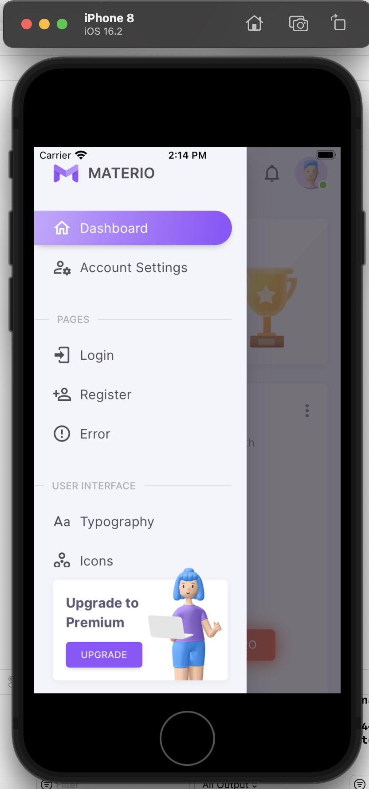
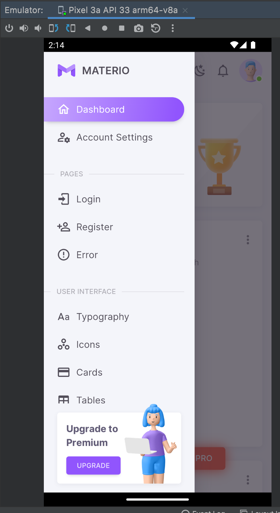
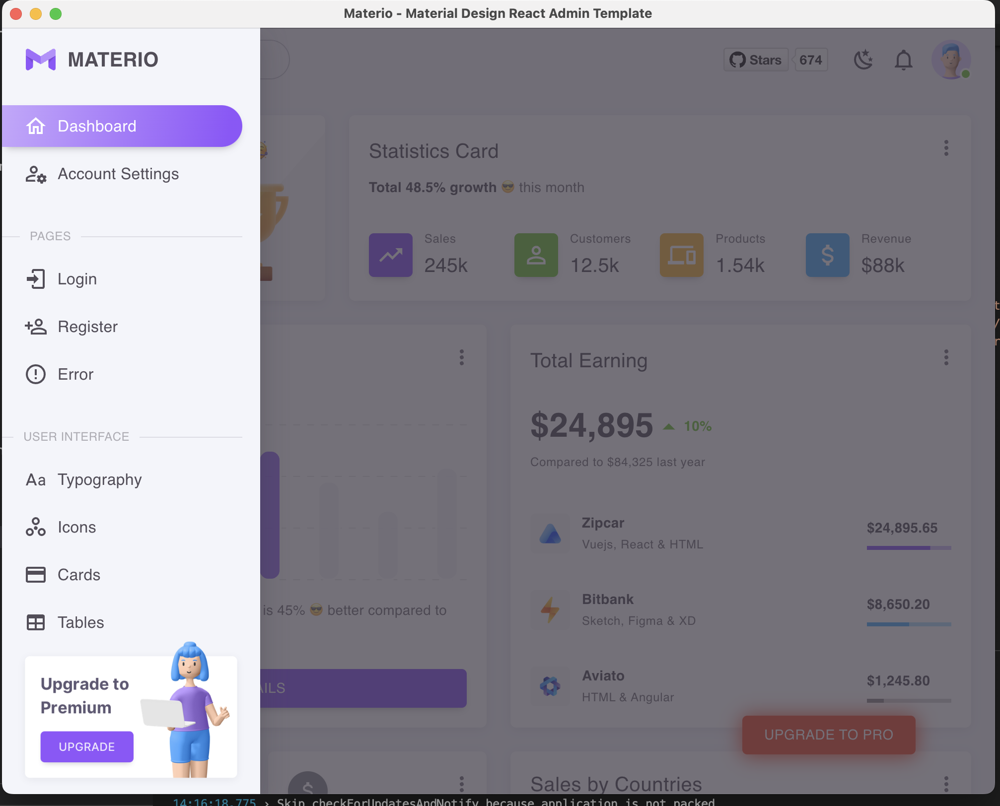
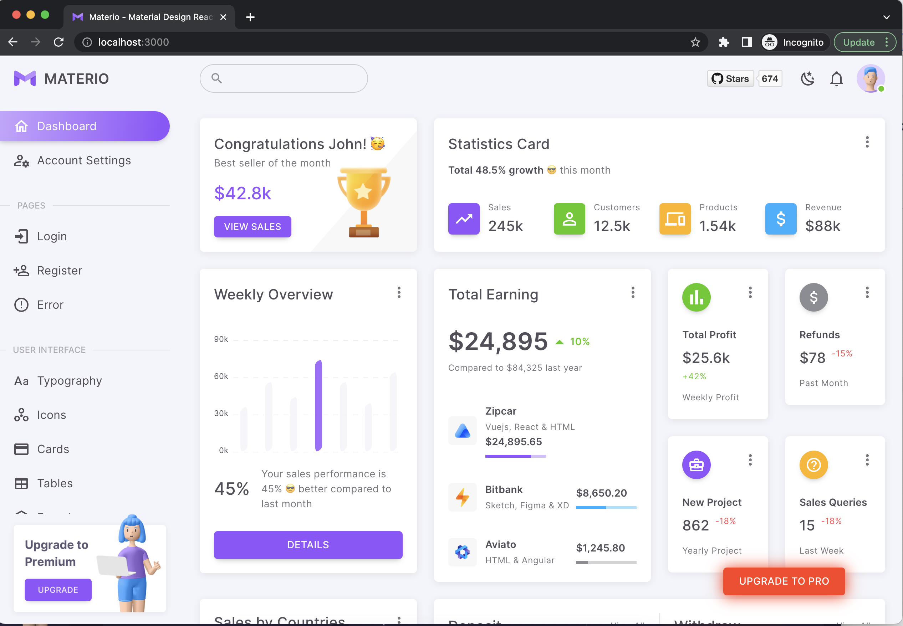

# cross-platform-nextjs
A boilerplate for building cross platform app (Mac, Linux, Windows, ios, Android) with nextjs, react, and material-ui.

## How to develop
npm i

npx ionic capacitor add android

npx ionic capacitor add ios

npm run export

### Start electron
npm run run:electron

### Build for Mac, Linux, Windows
npm run build:mac

npm run build:linux

npm run build:win

### Open Xcode to build for ios
npm run open:ios

### Open Android Studio to build for Android
npm run open:android

# This project is set as the root workspace project because electron-builder needs to be installed at the same level's node_modules
# Template is cloned from materio-mui-react-nextjs-admin-template-free
# jest is not added yet

## Screens
### Running on iPhone

    

### Running on Android

    

### Running on Desktop

    

### Running on Web

    

